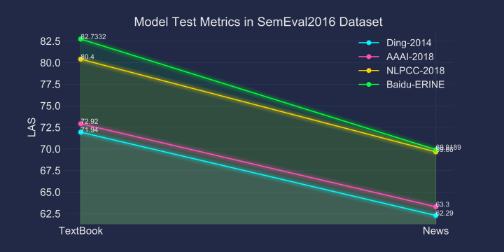

# BiaffineDependencyParsing
BERT+Transformer+Biaffine dependency parser
## Update

[2020-04-23] 修复数据加载中一个bug，在use_cache=True时可大幅度缩短数据加载准备耗时

## Result


以上结果均为在Semeval-2016-Test集上测试得到的LAS

**详细结果见: [metrics记录](./metrics.csv)**

## Semeval-2016 Task9数据集
原始评测数据集：[HIT-SCIR/SemEval-2016: SemEval-2016 Task 9: Chinese Semantic Dependency Parsing](https://github.com/HIT-SCIR/SemEval-2016)

原始数据集格式不符合conllu格式，你也可以使用我们[处理过后的数据集](https://github.com/LiangsLi/LSTM_Biaffine_Dependency_Parser_PyTorch/tree/master/SDP)，或者使用[脚本](https://github.com/LiangsLi/ConlluToolkit/blob/master/ConlluToolkit/convert.py)自己处理

数据集处理完成之后需要在yaml配置文件中写入，例如：

>data_set:
>    `data_dir`: 'dataset/sem16'
>    `train_file`: 'train/text_news.train.conllu'
>    `dev_file`: 'dev/sdp_news_dev.conllu'
>    `test_file`: 'test/sdp_news_test.conllu'

同时根据数据集的相关信息合理设置`per_gpu_train_batch_size`、`max_seq_len`等参数

## 使用

### 训练Train
查看帮助信息：`python main.py train -h`

```shell
CUDA_VISIBLE_DEVICES=0,1,2,3 python main.py train -c config_files/bert_biaffine.yaml
```
### torch.distributed 分布式训练

[distributedDataParallel VS dataParallel](parallelTrain.md)

> 当GPU卡数较多或数据量较大（或者max_seq_len较大时），推荐使用`torch.distributed`训练

```shell script
CUDA_VISIBLE_DEVICES=0,1,2,3,5,6 python -m torch.distributed.launch --nproc_per_node=6 main.py -c config_files/bert_biaffine.yaml
```

### 验证Dev

查看帮助信息：`python main.py dev -h`

```shell
CUDA_VISIBLE_DEVICES=0 python main.py dev -m <模型保存路径> -i <输入gold conllu文件> -o <输出文件>
```
### 推理Inference

查看帮助信息：`python main.py infer -h`

```shell
CUDA_VISIBLE_DEVICES=0 python main.py infer -m <模型保存路径> -i <输入conllu文件> -o <输出文件>
```
## References

**\[1\]** Ding, Y., Shao, Y., Che, W., Liu, T., 2014. Dependency Graph Based Chinese Semantic Parsing, in: Sun, M., Liu, Y., Zhao, J. (Eds.), Chinese Computational Linguistics and Natural Language Processing Based on Naturally Annotated Big Data, Lecture Notes in Computer Science. Springer International Publishing, Cham, pp. 58–69. https://doi.org/10.1007/978-3-319-12277-9_6

**\[2\]** Wang, Y., Che, W., Guo, J., Liu, T., 2018. A Neural Transition-Based Approach for Semantic Dependency Graph Parsing, in: AAAI.

**\[3\]** Dozat, T., Manning, C.D., 2018. Simpler but More Accurate Semantic Dependency Parsing, in: Proceedings of the 56th Annual Meeting of the Association for Computational Linguistics (Volume 2: Short Papers). Presented at the ACL 2018, Association for Computational Linguistics, Melbourne, Australia, pp. 484–490. https://doi.org/10.18653/v1/P18-2077

**\[4\]** Li, Y., Li, Z., Zhang, M., Wang, R., Li, S., Si, L., 2019. Self-attentive biaffine dependency parsing, in: IJCAI International Joint Conference on Artificial Intelligence. pp. 5067–5073. https://doi.org/10.24963/ijcai.2019/704

**\[5\]** Kondratyuk, D., Straka, M., 2019. 75 Languages, 1 Model: Parsing Universal Dependencies Universally. pp. 2779–2795. https://doi.org/10.18653/v1/d19-1279

## 相关项目：

- https://github.com/Hyperparticle/udify
- https://github.com/nikitakit/self-attentive-parser
- https://github.com/WangYuxuan93/CLBT
- https://github.com/stanfordnlp/stanfordnlp